# Laporan Praktikum Sistem Operasi 2026 - Modul 3
## Thread, IPC, dan RPC dengan Bahasa C

**Nama:** Keisya Halimah Mulia  
**NRP:** 5027251068  
**Kelas:** A

---

## Daftar Isi

- [Persiapan Direktori dan Repository](#persiapan-direktori-dan-repository)
- [Soal 1: Present Day, Present Time (The Wired)](#soal-1-present-day-present-time-the-wired)
  - [Deskripsi Soal 1](#deskripsi-soal-1)
  - [Struktur File Soal 1](#struktur-file-soal-1)
  - [Penjelasan Kode Penting Soal 1](#penjelasan-kode-penting-soal-1)
  - [Cara Kompilasi dan Menjalankan Soal 1](#cara-kompilasi-dan-menjalankan-soal-1)
  - [Output dan Hasil Soal 1](#output-dan-hasil-soal-1)
  - [Error dan Solusi Soal 1](#error-dan-solusi-soal-1)
- [Soal 2: The Battle of Eterion](#soal-2-the-battle-of-eterion)
  - [Deskripsi Soal 2](#deskripsi-soal-2)
  - [Struktur File Soal 2](#struktur-file-soal-2)
  - [Penjelasan Kode Penting Soal 2](#penjelasan-kode-penting-soal-2)
  - [Cara Kompilasi dan Menjalankan Soal 2](#cara-kompilasi-dan-menjalankan-soal-2)
  - [Output dan Hasil Soal 2](#output-dan-hasil-soal-2)
  - [Error dan Solusi Soal 2](#error-dan-solusi-soal-2)
- [Revisi](#revisi)
  - [Revisi Soal 2](#revisi-soal-2)

---

## Persiapan Direktori dan Repository

Sebelum mulai mengerjakan, saya menyiapkan struktur folder dan menghubungkannya ke GitHub. Karena file *executable* (hasil compile) dan file *log* tidak boleh ikut masuk ke repository, saya menggunakan `.gitignore` dan perintah `git rm --cached` untuk membersihkannya.

```bash
# Membuat direktori utama dan inisialisasi Git
mkdir SISOP-3-2026-IT-068 && cd SISOP-3-2026-IT-068
git init
git remote add origin https://github.com/keisyaahm/SISOP-3-2026-IT-068.git
git branch -M main

# Membuat struktur folder untuk soal 1 dan soal 2
mkdir soal1 soal2

# Membuat .gitignore agar file binary tidak ikut ke GitHub
cat > soal1/.gitignore << 'EOF'
navi
wired
history.log
protocol.c
EOF

cat > soal2/.gitignore << 'EOF'
orion
eternal
eterion.dat
EOF

# Kalau binary sudah terlanjur ter-track, hapus dari cache Git
git rm --cached soal1/navi soal1/wired soal1/history.log
git rm --cached soal2/orion soal2/eternal soal2/eterion.dat

# Commit dan push ke GitHub
git add .
git commit -m "clean: remove binaries, add gitignore"
git push -u origin main
```
Struktur yang di linux
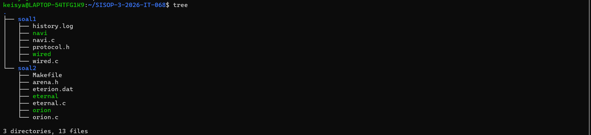

```
SISOP-3-2026-IT-068/
├── soal1/
│   ├── .gitignore
│   ├── navi.c
│   ├── protocol.h
│   └── wired.c
└── soal2/
    ├── .gitignore
    ├── arena.h
    ├── eternal.c
    ├── orion.c
    └── Makefile
```

Struktur akhir repository yang masuk ke GitHub:

```
SISOP-3-2026-IT-068/
├── soal1/
│   ├── .gitignore
│   ├── navi.c
│   ├── protocol.h
│   └── wired.c
└── soal2/
    ├── .gitignore
    ├── arena.h
    ├── eternal.c
    ├── orion.c
    └── Makefile
```

---

## Soal 1: Present Day, Present Time (The Wired)

### Deskripsi Soal 1

Membangun sistem chat jaringan bernama **The Wired** menggunakan pendekatan *Client-Server* berbasis **TCP Socket**. Ketentuan utama:

1. `wired.c` berperan sebagai **server** pusat jaringan
2. `navi.c` berperan sebagai **client** yang menghubungkan pengguna
3. Pengiriman dan penerimaan pesan di sisi client berjalan **asinkron** menggunakan *Thread* (bukan `fork()`)
4. Nama pengguna harus **unik** — tidak boleh ada dua pengguna dengan nama yang sama
5. Setiap pesan yang masuk di-**broadcast** ke semua pengguna aktif lainnya
6. Terdapat fitur **RPC (Remote Procedure Call)** khusus admin bernama `The Knights` dengan password `protocol7`, untuk:
   - Melihat jumlah pengguna aktif
   - Melihat *uptime* server (sudah berapa detik berjalan)
   - Mematikan server secara darurat (*Emergency Shutdown*)
7. Semua aktivitas dicatat di file **`history.log`** dengan format `[YYYY-MM-DD HH:MM:SS] [Role] [Action]`

### Struktur File Soal 1

| File | Peran |
|------|-------|
| `protocol.h` | Header bersama — berisi definisi struct `Packet`, enum `MsgType`, konstanta PORT/IP, dan fungsi `get_current_time()` |
| `wired.c` | Server — menerima koneksi, mengelola client, broadcast pesan, RPC, logging |
| `navi.c` | Client — input nama, kirim/terima pesan secara asinkron, mode admin |

### Penjelasan Kode Penting Soal 1

#### A. `protocol.h` — Kontrak Komunikasi

File ini adalah "bahasa bersama" antara server dan client. Semua tipe pesan dan struktur data didefinisikan di sini agar server dan client berbicara dalam format yang sama.

```c
// Tipe pesan yang bisa dikirim
typedef enum {
    MSG_LOGIN,    // pertama kali terhubung
    MSG_CHAT,     // pesan chat biasa
    MSG_EXIT,     // mau keluar
    MSG_RPC_REQ,  // request admin ke server
    MSG_RPC_RES,  // balasan server ke admin
    MSG_ERROR     // penolakan atau error
} MsgType;

// Struktur paket data yang dikirim lewat socket
typedef struct {
    MsgType type;
    char sender[50];
    char content[BUFFER_SIZE];
} Packet;
```

Setiap kali server dan client bertukar data, mereka mengirim satu `Packet` yang berisi tipe pesan, nama pengirim, dan isi pesan.

#### B. `wired.c` — Server

**Inisialisasi dan Setup TCP Socket:**

Server membuat koneksi TCP dari nol menggunakan urutan: `socket()` → `setsockopt()` → `bind()` → `listen()` → `accept()`.

```c
// 1. Buat socket TCP
server_fd = socket(AF_INET, SOCK_STREAM, 0);

// 2. SO_REUSEADDR agar port tidak nyangkut saat server di-restart
setsockopt(server_fd, SOL_SOCKET, SO_REUSEADDR | SO_REUSEPORT, &opt, sizeof(opt));

// 3. Konfigurasi alamat — port 8080, terima dari semua IP
address.sin_family = AF_INET;
address.sin_addr.s_addr = INADDR_ANY;
address.sin_port = htons(PORT);

// 4. Bind — kaitkan socket dengan alamat
bind(server_fd, (struct sockaddr *)&address, sizeof(address));

// 5. Listen — mulai mendengarkan, antrian max 10
listen(server_fd, 10);

// 6. Loop accept — terus terima client baru
while (1) {
    new_socket = accept(server_fd, ...);
    // Buat thread baru untuk handle client ini
    pthread_create(&tid, NULL, handle_client, client_sock_ptr);
    pthread_detach(tid); // thread auto-cleanup saat selesai
}
```

**Thread-per-Client:**

Setiap client yang masuk dibuatkan satu *thread* khusus (`handle_client`). Ini memungkinkan server melayani banyak client secara bersamaan tanpa saling menunggu.

**Mutex untuk Cegah Race Condition:**

Karena banyak *thread* berjalan bersamaan dan mengakses data yang sama (array `clients[]` dan file `history.log`), digunakan dua *mutex*:

```c
pthread_mutex_t clients_mutex = PTHREAD_MUTEX_INITIALIZER; // untuk array clients
pthread_mutex_t log_mutex = PTHREAD_MUTEX_INITIALIZER;     // untuk file log

// Contoh penggunaan di fungsi broadcast:
void broadcast_message(Packet *pkt, int sender_socket) {
    pthread_mutex_lock(&clients_mutex);   // KUNCI — thread lain nunggu dulu
    for (int i = 0; i < MAX_CLIENTS; i++) {
        if (clients[i].is_active && clients[i].socket != sender_socket) {
            send(clients[i].socket, pkt, sizeof(Packet), 0);
        }
    }
    pthread_mutex_unlock(&clients_mutex); // BUKA — thread lain boleh masuk
}
```

**3 Fase Handle Client:**

```
FASE 1: LOGIN
  → Terima paket MSG_LOGIN
  → Cek nama duplikat (pakai clients_mutex)
  → Jika duplikat: kirim MSG_ERROR, tutup koneksi
  → Jika OK: daftarkan ke array clients[], kirim welcome

FASE 2: CHAT / RPC
  → Loop recv() — terus dengarkan paket dari client ini
  → MSG_CHAT → tulis log → broadcast ke semua client lain
  → MSG_RPC_REQ (hanya admin) → eksekusi command → kirim MSG_RPC_RES
  → MSG_EXIT → keluar loop

FASE 3: DISCONNECT
  → Tandai slot client jadi tidak aktif (is_active = 0)
  → Tulis log disconnect
  → Tutup socket
```

**RPC Admin — Eksekusi Fungsi Jarak Jauh:**

```c
if (strcmp(pkt.content, "RPC_GET_USERS") == 0) {
    write_log("Admin", pkt.content);
    // Hitung user aktif, admin tidak dihitung
    int count = 0;
    pthread_mutex_lock(&clients_mutex);
    for(int i=0; i<MAX_CLIENTS; i++) {
        if(clients[i].is_active && !clients[i].is_admin) count++;
    }
    pthread_mutex_unlock(&clients_mutex);
    sprintf(res.content, "Active NAVI Units: %d\n", count);
    send(client_socket, &res, sizeof(Packet), 0);
}
else if (strcmp(pkt.content, "RPC_GET_UPTIME") == 0) {
    write_log("Admin", pkt.content);
    time_t now = time(NULL);
    int diff = (int)(now - server_start_time); // selisih detik sejak server hidup
    sprintf(res.content, "Server Uptime: %d seconds\n", diff);
    send(client_socket, &res, sizeof(Packet), 0);
}
else if (strcmp(pkt.content, "RPC_SHUTDOWN") == 0) {
    write_log("Admin", pkt.content);
    write_log("System", "EMERGENCY SHUTDOWN INITIATED");
    exit(0); // matikan server seketika
}
```

**Logging ke `history.log`:**

```c
void write_log(const char *role, const char *action) {
    pthread_mutex_lock(&log_mutex); // kunci agar tidak ditulis bersamaan
    FILE *f = fopen("history.log", "a"); // mode "a" = append, tidak timpa
    if (f) {
        char time_str[30];
        get_current_time(time_str);
        fprintf(f, "[%s] [%s] [%s]\n", time_str, role, action);
        fclose(f);
    }
    pthread_mutex_unlock(&log_mutex);
}
```

#### C. `navi.c` — Client

**Alur Utama Client:**

```
1. Buat socket → connect ke server port 8080
2. Input nama pengguna
3. Jika nama = "The Knights" → minta password → verifikasi
4. Kirim MSG_LOGIN ke server
5. Buat receiver thread (terima pesan masuk secara async)
6. Main thread: loop input dari keyboard
   - Mode normal: fgets() → kirim MSG_CHAT
   - Mode admin: tampilkan console → kirim MSG_RPC_REQ
```

**Asinkron dengan Thread:**

```c
// Receiver thread berjalan paralel dengan main thread
// Main thread: menunggu input user (fgets)
// Receiver thread: menunggu pesan dari server (recv)

pthread_t recv_thread;
pthread_create(&recv_thread, NULL, receive_handler, NULL);

// Di dalam receive_handler:
void *receive_handler(void *arg) {
    Packet pkt;
    while (recv(sock, &pkt, sizeof(Packet), 0) > 0) {
        if (pkt.type == MSG_CHAT) {
            printf("\n[%s]: %s\n> ", pkt.sender, pkt.content);
            fflush(stdout);
        }
        else if (pkt.type == MSG_ERROR) {
            printf("[System] %s", pkt.content);
            fflush(stdout);
            _exit(0); // paksa keluar tanpa deadlock
        }
        else if (pkt.type == MSG_RPC_RES) {
            printf("\n%s\n> ", pkt.content);
            fflush(stdout);
        }
    }
    // recv() = 0 artinya server mati
    printf("\n[System] Connection lost. The Wired has been shut down.\n");
    _exit(0);
    return NULL;
}
```

**Admin Console:**

```c
// Validasi admin di sisi client
if (strcmp(my_name, "The Knights") == 0) {
    char pass[50];
    printf("Enter Password: ");
    fgets(pass, 50, stdin);
    pass[strcspn(pass, "\n")] = 0;

    if (strcmp(pass, "protocol7") != 0) {
        printf("[System] Authentication Failed.\n");
        close(sock); return 0;
    }
    is_admin = 1;
}

// Menu admin yang tampil di loop utama
if (cmd == 1) strcpy(rpc_pkt.content, "RPC_GET_USERS");
else if (cmd == 2) strcpy(rpc_pkt.content, "RPC_GET_UPTIME");
else if (cmd == 3) strcpy(rpc_pkt.content, "RPC_SHUTDOWN");
else if (cmd == 4) handle_sigint(0);
else {
    printf("[System] Invalid command.\n");
    continue; // skip send jika input tidak valid
}
send(sock, &rpc_pkt, sizeof(Packet), 0);
```

### Cara Kompilasi dan Menjalankan Soal 1

```bash
cd ~/SISOP-3-2026-IT-068/soal1

# Kompilasi server
gcc -pthread -o wired wired.c

# Kompilasi client
gcc -pthread -o navi navi.c

# Terminal 1 — Jalankan server dulu
./wired

# Terminal 2 — Jalankan client pertama
./navi

# Terminal 3 — Jalankan client kedua
./navi

# Terminal 4 — Jalankan sebagai admin
./navi
# Enter your name: The Knights
# Enter Password: protocol7
```

### Output dan Hasil Soal 1

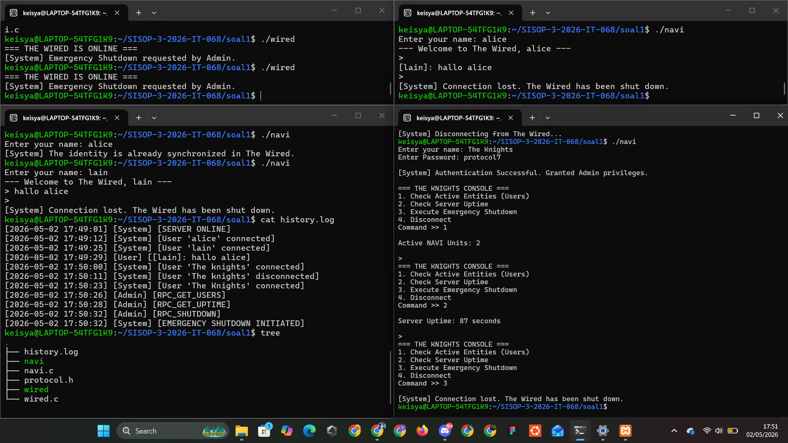

user juga tidak akan bisa login dengan akun yang sama

### Error dan Solusi Soal 1

**Error 1: Log admin muncul baris kosong `[Admin] []`**

Masalah: Di kode awal, `write_log("Admin", pkt.content)` dipanggil sebelum isi `pkt.content` divalidasi. Kalau input admin tidak valid (misal menekan Enter sembarangan), packet kosong tetap terkirim dan di-log.

```
# Sebelum diperbaiki, history.log berisi:
[2026-04-29 15:10:12] [Admin] []
[2026-04-29 15:10:13] [Admin] []
```

Solusi: Pindahkan `write_log` ke dalam masing-masing blok `if` sehingga hanya command yang valid yang dicatat, dan tambahkan `else { continue; }` di client untuk skip pengiriman jika input tidak valid.

```c
// Di wired.c — write_log dipindah ke dalam tiap branch:
if (strcmp(pkt.content, "RPC_GET_USERS") == 0) {
    write_log("Admin", pkt.content); // hanya tulis log kalau command valid
    ...
}

// Di navi.c — tambah else untuk input tidak valid:
else {
    printf("[System] Invalid command.\n");
    continue; // tidak kirim packet kosong ke server
}
send(sock, &rpc_pkt, sizeof(Packet), 0);
```

**Error 2: Deadlock saat client menerima error dari server**

Masalah: Saat server menolak nama duplikat dan mengirim `MSG_ERROR`, receiver thread mencoba memanggil `exit(0)`. Tapi `exit(0)` memicu pembersihan buffer I/O yang sedang dipakai oleh main thread (`fgets()`), sehingga program *hang* (tidak bisa ditutup).

Solusi: Ganti `exit(0)` dengan `_exit(0)` yang langsung menghentikan proses tanpa membersihkan buffer, sehingga tidak ada konflik I/O.

```c
// Sebelum:
exit(0);

// Sesudah:
_exit(0); // paksa keluar tanpa trigger cleanup I/O
```

---

## Soal 2: The Battle of Eterion

### Deskripsi Soal 2

Membangun simulasi game RPG *multiplayer real-time* berbasis **IPC (Inter-Process Communication)** lokal — tanpa jaringan. Komponen utama:

1. **`orion.c` (Server/Engine):** Mengelola database pemain menggunakan *Shared Memory*, melayani request register/login/logout via *Message Queue*, dan menyimpan data secara *persistent* ke file `eterion.dat`
2. **`eternal.c` (Client/Game):** Antarmuka pemain — register, login, profil, armory (toko senjata), match history, battle, logout
3. **Matchmaking:** Cari lawan selama maksimal 35 detik. Jika tidak ada pemain lain, lawan Bot
4. **Battle Real-time:** Tekan `a` untuk Attack, `u` untuk Ultimate — tanpa harus tekan Enter
5. **Semaphore:** Melindungi akses ke *Shared Memory* saat battle berlangsung agar tidak terjadi *race condition*

**Formula stats pemain:**

| Stat | Formula |
|------|---------|
| Damage | `10 + (total_xp / 50) + highest_dmg_weapon` |
| Health | `100 + (total_xp / 10)` |
| XP Menang | +50 |
| XP Kalah | +15 |
| Gold Menang | +120 |
| Gold Kalah | +30 |
| Level | `1 + (total_xp / 100)` |
| Ultimate | `Total Damage × 3` (butuh weapon) |

**Daftar senjata di Armory:**

| Senjata | Harga | Bonus Damage |
|---------|-------|--------------|
| Wood Sword | 100G | +5 |
| Iron Sword | 300G | +15 |
| Steel Axe | 600G | +30 |
| Demon Blade | 1500G | +60 |
| God Slayer | 5000G | +150 |

### Struktur File Soal 2

| File | Peran |
|------|-------|
| `arena.h` | Header bersama — definisi semua struct, IPC key, fungsi semaphore |
| `orion.c` | Server — kelola shared memory, message queue, semaphore, persistent save |
| `eternal.c` | Client — UI game, matchmaking, battle loop, armory, history |
| `Makefile` | Script otomatis compile dan bersihkan IPC |

### Penjelasan Kode Penting Soal 2

#### A. `arena.h` — Pusat Definisi

Semua struktur data dan konstanta IPC didefinisikan di sini agar `orion.c` dan `eternal.c` menggunakan format yang sama.

```c
// Kunci unik untuk tiap IPC resource
#define SHM_KEY 0x00001234   // Shared Memory
#define MSG_KEY 0x00005678   // Message Queue
#define SEM_KEY 0x00009012   // Semaphore

// Data satu pemain
typedef struct {
    char username[50];
    char password[50];
    int gold;
    int xp;
    int lvl;
    int highest_dmg_weapon; // damage weapon terbesar yang dimiliki
    int is_active;          // 1 = sedang login, 0 = offline
    int status;             // 0=Idle, 1=Matchmaking, 2=In Battle
    MatchHistory history[50];
    int history_count;
} User;

// Satu slot arena pertarungan
typedef struct {
    int active;      // 1 = arena sedang dipakai
    int is_bot;      // 1 = lawan bot
    char p1[50]; char p2[50];
    int p1_hp; int p2_hp;
    int p1_max; int p2_max;
    char logs[5][100]; // 5 log combat teratas
} BattleArena;

// Database utama yang disimpan di Shared Memory
typedef struct {
    User users[MAX_USERS];      // maks 50 pemain
    int total_users;
    BattleArena arenas[MAX_BATTLES]; // maks 25 arena
} GameDatabase;

// Fungsi semaphore — pengganti mutex untuk IPC
void sem_lock(int semid) {
    struct sembuf p = {0, -1, SEM_UNDO}; // kurangi 1 (lock)
    semop(semid, &p, 1);
}
void sem_unlock(int semid) {
    struct sembuf v = {0, 1, SEM_UNDO};  // tambah 1 (unlock)
    semop(semid, &v, 1);
}
```

#### B. `orion.c` — Server/Engine

**Setup IPC dan Load Data:**

```c
int main() {
    signal(SIGINT, handle_shutdown); // tangkap Ctrl+C untuk save data

    // Buat Shared Memory
    shmid = shmget(SHM_KEY, sizeof(GameDatabase), IPC_CREAT | 0666);
    db = (GameDatabase *)shmat(shmid, NULL, 0); // attach ke proses ini

    // Coba load dari file eterion.dat (data dari sesi sebelumnya)
    FILE *fp = fopen("eterion.dat", "rb");
    if (fp != NULL) {
        fread(db, sizeof(GameDatabase), 1, fp); // baca binary ke shared memory
        fclose(fp);
        // Reset semua pemain ke status offline (sesi baru)
        for(int i = 0; i < db->total_users; i++) {
            db->users[i].is_active = 0;
            db->users[i].status = 0;
        }
        printf("Orion is ready (PID: %d). DB Loaded: %d warriors.\n", getpid(), db->total_users);
    } else {
        db->total_users = 0; // mulai fresh
        printf("Orion is ready (PID: %d). New universe started.\n", getpid());
    }

    // Buat Message Queue dan Semaphore
    msgid = msgget(MSG_KEY, IPC_CREAT | 0666);
    semid = semget(SEM_KEY, 1, IPC_CREAT | 0666);
    semctl(semid, 0, SETVAL, 1); // inisialisasi semaphore ke nilai 1 (unlocked)
    ...
}
```

**Persistent Save saat Server Mati:**

```c
void handle_shutdown(int sig) {
    printf("\n[Orion] Shutting down. Saving universe...\n");
    FILE *fp = fopen("eterion.dat", "wb"); // buka untuk tulis binary
    if (fp != NULL) {
        fwrite(db, sizeof(GameDatabase), 1, fp); // salin seluruh shared memory ke file
        fclose(fp);
        printf("[Orion] Universe saved successfully to eterion.dat!\n");
    }
    shmdt(db); // lepas shared memory
    exit(0);
}
```

**Loop Utama — Proses Request dari Client:**

```c
while (1) {
    if (msgrcv(msgid, &msg, sizeof(GameMessage) - sizeof(long), 1, 0) > 0) {
        GameMessage reply = msg;
        reply.mtype = msg.sender_pid; // balas ke PID pengirim (anti salah sasaran)

        sem_lock(semid); // kunci sebelum ubah data

        if (msg.command == 1) { // REGISTER
            // cek duplikat nama → daftarkan dengan Gold=150, Lvl=1, XP=0
        }
        else if (msg.command == 2) { // LOGIN
            // cek username+password → cek is_active==0 (anti double login)
        }
        else if (msg.command == 4) { // LOGOUT
            // set is_active=0, status=0
        }

        sem_unlock(semid);
        msgsnd(msgid, &reply, sizeof(GameMessage) - sizeof(long), 0); // kirim balasan
    }
}
```

#### C. `eternal.c` — Client/Game

**Koneksi ke IPC (bukan socket):**

```c
int main() {
    // Attach ke IPC yang sudah dibuat oleh orion
    shmid = shmget(SHM_KEY, sizeof(GameDatabase), 0666);
    msgid = msgget(MSG_KEY, 0666);
    semid = semget(SEM_KEY, 1, 0666);

    if (shmid < 0 || msgid < 0) {
        printf("Orion are you there?\n"); // orion belum jalan
        return 1;
    }
    db = (GameDatabase *)shmat(shmid, NULL, 0); // attach shared memory
    ...
}
```

**Fungsi Kirim Request ke Server:**

```c
int send_request(int cmd, char* d1, char* d2) {
    GameMessage msg;
    msg.mtype = 1;                // server baca mtype=1
    msg.sender_pid = getpid();    // ID proses ini, untuk menerima balasan
    msg.command = cmd;
    strcpy(msg.data1, d1);
    strcpy(msg.data2, d2);
    msgsnd(msgid, &msg, sizeof(GameMessage)-sizeof(long), 0);

    GameMessage rep;
    msgrcv(msgid, &rep, sizeof(GameMessage)-sizeof(long), getpid(), 0); // tunggu balasan untuk PID ini
    return rep.response; // 1 = sukses, 0 = gagal
}
```

**Matchmaking 35 Detik:**

```c
void matchmake_and_battle() {
    sem_lock(semid);
    db->users[my_id_idx].status = 1; // set status = Matchmaking
    sem_unlock(semid);

    int opponent_found = 0;
    int is_p1 = 0;
    char opp_name[50] = "Wild Beast (Bot)";

    for(int timer=1; timer<=35; timer++) {
        printf("\rSearching for an opponent... [%d s] ", timer);

        sem_lock(semid);
        // Cek: apakah ada yang sudah memilihku sebagai P2?
        if (db->users[my_id_idx].status == 2) {
            // Aku jadi P2, cari arena yang berisi namaku
            opponent_found = 1; is_p1 = 0;
            ...
        }
        // Coba cari pemain lain yang status=1 (matchmaking)
        for(int i=0; i<db->total_users; i++) {
            if(i != my_id_idx && db->users[i].status == 1 && db->users[i].is_active) {
                // Ketemu! Aku jadi P1, setup arena
                opponent_found = 1; is_p1 = 1;
                ...
            }
        }
        sem_unlock(semid);
        if(opponent_found) break;
        sleep(1);
    }

    // Kalau 35 detik habis tanpa lawan → lawan Bot
    if(!opponent_found) {
        // setup arena vs Wild Beast (Bot)
        is_p1 = 1;
        ...
    }
    ...
}
```

**Battle Loop — Non-blocking Input dengan termios:**

```c
// Ubah setting terminal agar getchar() tidak butuh Enter
struct termios oldt, newt;
tcgetattr(STDIN_FILENO, &oldt);
newt = oldt;
newt.c_lflag &= ~(ICANON | ECHO); // matikan mode canonical dan echo
newt.c_cc[VMIN] = 1;  // tunggu minimal 1 karakter
newt.c_cc[VTIME] = 0;
tcsetattr(STDIN_FILENO, TCSANOW, &newt);

// Hitung damage SEKALI di awal battle (konsisten sepanjang battle)
sem_lock(semid);
int current_dmg = 10 + (db->users[my_id_idx].xp / 50) + db->users[my_id_idx].highest_dmg_weapon;
sem_unlock(semid);

in_battle = 1;
pthread_t disp_tid;
pthread_create(&disp_tid, NULL, battle_display_thread, NULL); // thread display berjalan paralel

while(in_battle) {
    sem_lock(semid);
    int m_hp = is_p1 ? db->arenas[current_arena_idx].p1_hp : db->arenas[current_arena_idx].p2_hp;
    int e_hp = is_p1 ? db->arenas[current_arena_idx].p2_hp : db->arenas[current_arena_idx].p1_hp;
    sem_unlock(semid);

    if (m_hp <= 0 || e_hp <= 0) break; // battle selesai

    int key = getchar(); // block sampai ada tombol ditekan
    if (key == 'a' || key == 'u') {
        sem_lock(semid);
        int dmg_dealt = current_dmg;
        if (key == 'u') {
            if (db->users[my_id_idx].highest_dmg_weapon > 0) dmg_dealt = current_dmg * 3;
            else dmg_dealt = 0; // gagal ulti tanpa weapon
        }
        if (dmg_dealt > 0) {
            if (is_p1) db->arenas[current_arena_idx].p2_hp -= dmg_dealt;
            else       db->arenas[current_arena_idx].p1_hp -= dmg_dealt;
            // tulis combat log
        }
        sem_unlock(semid);

        // Balasan serangan bot
        if (db->arenas[current_arena_idx].is_bot && is_p1) {
            sem_lock(semid);
            db->arenas[current_arena_idx].p1_hp -= 15;
            sem_unlock(semid);
        }
        sleep(1); // cooldown 1 detik
    }
}

tcsetattr(STDIN_FILENO, TCSANOW, &oldt); // kembalikan terminal ke normal
```

**Thread Display Battle (Real-time UI):**

```c
void *battle_display_thread(void *arg) {
    printf("\033[H\033[J"); // clear screen sekali di awal
    while(in_battle) {
        printf("\033[H"); // pindah kursor ke pojok kiri atas (tidak flicker)
        printf("=== ARENA ===\n");
        printf("%-15s HP: %-5d / %-5d\n", db->arenas[current_arena_idx].p1,
               db->arenas[current_arena_idx].p1_hp, db->arenas[current_arena_idx].p1_max);
        printf("       VS\n");
        printf("%-15s HP: %-5d / %-5d\n\n", db->arenas[current_arena_idx].p2,
               db->arenas[current_arena_idx].p2_hp, db->arenas[current_arena_idx].p2_max);
        printf("Combat Log:\n");
        for(int i=0; i<5; i++) {
            if(strlen(db->arenas[current_arena_idx].logs[i]) > 0)
                printf("> %-50s\n", db->arenas[current_arena_idx].logs[i]);
        }
        printf("\nPress 'a' to Attack, 'u' to Ultimate\n");
        fflush(stdout);
        usleep(200000); // refresh 5x per detik
    }
    return NULL;
}
```

**Armory — Toko Senjata (5 Item):**

```c
sem_lock(semid);
int *g = &db->users[my_id_idx].gold;
int *w = &db->users[my_id_idx].highest_dmg_weapon;
// Sistem hanya menyimpan damage terbesar (tidak bisa downgrade)
if      (buy==1 && *g>=100)  { *g-=100;  if(5   > *w) *w=5;   printf("Beli Wood Sword sukses!\n"); }
else if (buy==2 && *g>=300)  { *g-=300;  if(15  > *w) *w=15;  printf("Beli Iron Sword sukses!\n"); }
else if (buy==3 && *g>=600)  { *g-=600;  if(30  > *w) *w=30;  printf("Beli Steel Axe sukses!\n"); }
else if (buy==4 && *g>=1500) { *g-=1500; if(60  > *w) *w=60;  printf("Beli Demon Blade sukses!\n"); }
else if (buy==5 && *g>=5000) { *g-=5000; if(150 > *w) *w=150; printf("Beli God Slayer sukses!\n"); }
else if (buy!=0) printf("Gold tidak cukup atau pilihan salah!\n");
sem_unlock(semid);
```

### Cara Kompilasi dan Menjalankan Soal 2

```bash
cd ~/SISOP-3-2026-IT-068/soal2

# Bersihkan IPC lama jika ada (wajib dilakukan sebelum mulai baru)
make clear_ipc

# Kompilasi otomatis (orion + eternal)
make

# Terminal 1 — Jalankan server/engine
./orion
# Output: Orion is ready (PID: XXXX). New universe started.
# atau: Orion is ready (PID: XXXX). DB Loaded: 2 warriors.

# Terminal 2 — Jalankan client pertama
./eternal
# Pilih 1. Register → masukkan username dan password
# Pilih 2. Login → masuk game

# Terminal 3 — Jalankan client kedua (untuk test PvP)
./eternal

# Untuk test persistensi data:
# Ctrl+C di terminal orion → data tersimpan ke eterion.dat
# Jalankan ./orion lagi → data ter-load otomatis
```

### Output dan Hasil Soal 2

**Orion (server) saat start:**
```
Orion is ready (PID: 8079). DB Loaded: 2 warriors.
```

**Eternal (client) saat register dan login:**

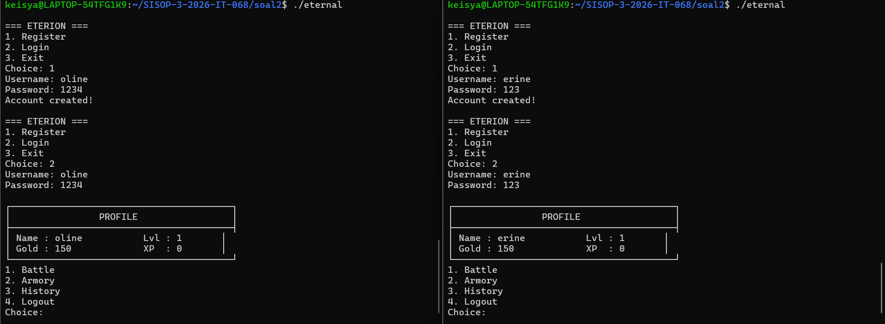

**Saat login dengan akun yang sudah aktif:**

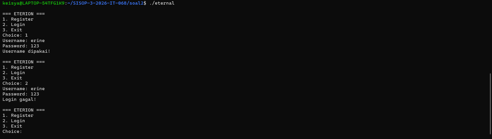

**Tampilan Arena saat Battle:**

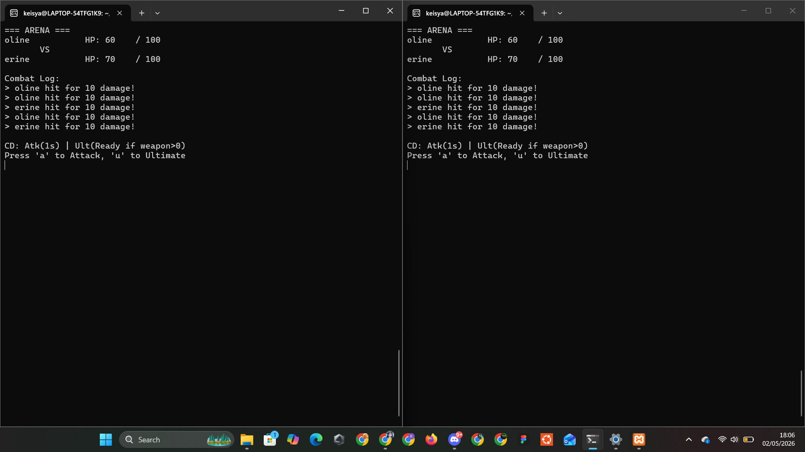

**Setelah Battle selesai:**

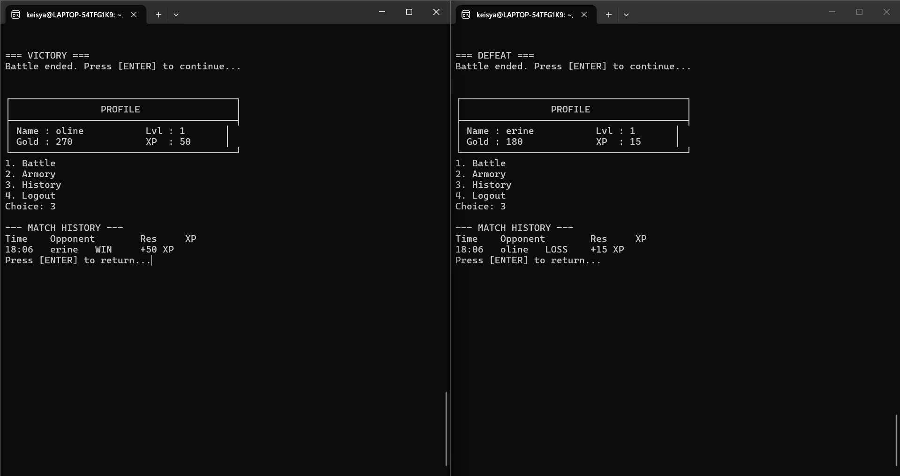


**Contoh perhitungan stats setelah battle:**

Kondisi awal: erine XP=0, Gold=150, weapon=0

Battle vs Bot, erine menang:
- XP: 0 + 50 = **50**
- Gold: 150 + 120 = **270**
- Level: 1 + (50/100) = **1** (belum naik)

Setelah beli Wood Sword (100G):
- Gold: 270 - 100 = **170**
- weapon: **5**

Battle berikutnya:
- Damage: 10 + (50/50) + 5 = **16**
- Ultimate: 16 × 3 = **48**
- HP: 100 + (50/10) = **105**


**Saat orion di-Ctrl+C (save data) dan dijalankan ulang (load data)**
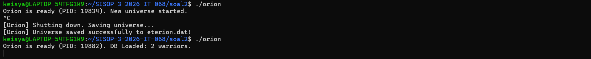

### Error dan Solusi Soal 2

**Error 1: Armory hanya 3 item, soal minta 5**

Masalah: Kode awal hanya menyediakan Wood Sword, Iron Sword, dan Demon Blade. Steel Axe (+30, 600G) dan God Slayer (+150, 5000G) tidak ada.

Solusi: Tambahkan 2 item yang kurang dan perbaiki nomor pilihan:

```c
// Sebelum (3 item):
printf("1. Wood Sword (100G, +5 Dmg)\n2. Iron Sword (300G, +15 Dmg)\n3. Demon Blade (1500G, +60 Dmg)\n");

// Sesudah (5 item):
printf("1. Wood Sword  (100G,  +5 Dmg)\n");
printf("2. Iron Sword  (300G,  +15 Dmg)\n");
printf("3. Steel Axe   (600G,  +30 Dmg)\n");  // baru
printf("4. Demon Blade (1500G, +60 Dmg)\n");
printf("5. God Slayer  (5000G, +150 Dmg)\n"); // baru
```

**Error 2: Damage berubah-ubah saat battle berlangsung**

Masalah: `current_dmg` dihitung ulang setiap iterasi loop battle di dalam `while(in_battle)`. Karena XP di shared memory bisa terbaca tidak konsisten, damage menjadi berubah-ubah (misal 10, lalu 16, lalu 10 lagi).

Solusi: Hitung `current_dmg` **satu kali saja** sebelum battle dimulai:

```c
// Sebelum (salah — di dalam loop):
while(in_battle) {
    sem_lock(semid);
    int current_dmg = 10 + (db->users[my_id_idx].xp / 50) + ...; // dihitung ulang
    ...
}

// Sesudah (benar — di luar loop, sekali sebelum battle):
sem_lock(semid);
int current_dmg = 10 + (db->users[my_id_idx].xp / 50) + db->users[my_id_idx].highest_dmg_weapon;
sem_unlock(semid);

in_battle = 1;
while(in_battle) {
    // current_dmg tidak dihitung ulang, tetap konsisten
    ...
}
```

**Error 3: Tombol 'a' tidak terbaca / HP tidak berkurang**

Masalah: Setting terminal `VMIN=0, VTIME=0` membuat `getchar()` langsung return `-1` jika tidak ada input, bukan menunggu. Akibatnya input 'a' sering tidak terbaca dan HP tidak berubah.

Solusi: Ubah `VMIN=1` agar `getchar()` *blocking* — menunggu sampai ada tombol yang ditekan:

```c
// Sebelum (salah):
newt.c_cc[VMIN] = 0;  // langsung return -1 jika tidak ada input
newt.c_cc[VTIME] = 1;

// Sesudah (benar):
newt.c_cc[VMIN] = 1;  // tunggu minimal 1 karakter sebelum return
newt.c_cc[VTIME] = 0;
```

**Error 4: Layar kedap-kedip dan ketikan tidak kelihatan**

Masalah: Display thread menggunakan `printf("\033[H\033[J")` yang me-*clear* seluruh layar setiap 200ms, termasuk karakter yang sedang diketik pengguna.

Solusi: Ganti dari *clear full screen* menjadi *move cursor to top* saja, sehingga teks lama ditimpa tanpa flicker, dan karakter yang diketik tidak terhapus:

```c
// Sebelum (clear full, menyebabkan flicker):
printf("\033[H\033[J");

// Sesudah (hanya pindah kursor — tidak flicker):
printf("\033[H\033[J"); // clear sekali di awal saja
while(in_battle) {
    printf("\033[H"); // hanya pindah kursor, tidak hapus layar
    ...
}
```

**Error 5: `[Admin] []` muncul di log**

Masalah yang sama seperti Soal 1 — packet kosong dari client admin terkirim ke server dan langsung di-log sebelum divalidasi.

Solusi: Di `navi.c`, tambahkan `else { continue; }` untuk input tidak valid. Di `wired.c`, pindahkan `write_log` ke dalam masing-masing branch `if`.

**Error 6: `make clear_ipc` lalu orion crash**

Masalah: IPC lama (shared memory, message queue, semaphore) dari sesi sebelumnya masih ada di kernel, menyebabkan konflik saat orion dibuat ulang.

Solusi: Selalu jalankan `make clear_ipc` sebelum memulai sesi baru:

```bash
make clear_ipc
# Perintah ini menghapus IPC dengan key yang sama dari kernel
./orion
```

---


# Revisi

### Revisi Soal 2

**1. SS Orion tidak nyala = Eternal tidak menampilkan main menu dan akan where are u**

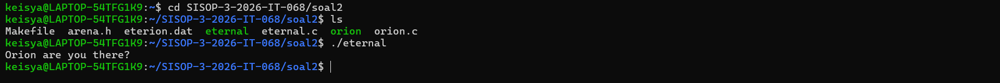

**2. Login dengan akun yang sama di dua terminal harusnya tidak bisa**

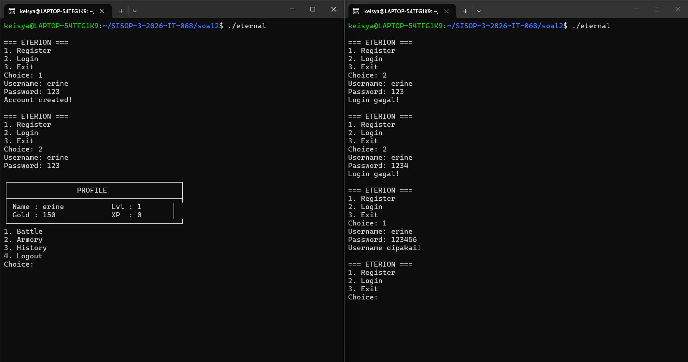

**3. Info senjata di battle, damage lebih besar setelah beli senjata, bisa ulti**

Ditambahkan tampilan nama senjata dan bonus damage di UI arena. Damage
otomatis lebih besar setelah beli senjata karena formula:

`Damage = 10 + (XP/50) + highest_dmg_weapon`

Ultimate (`u`) mengalikan total damage dengan 3, hanya bisa dipakai jika
sudah memiliki senjata.

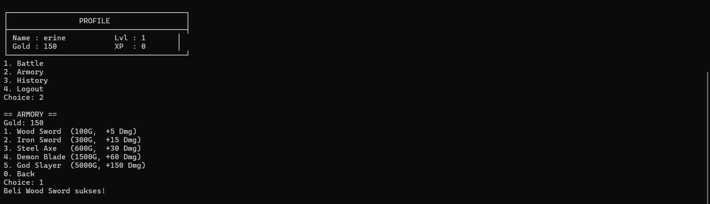
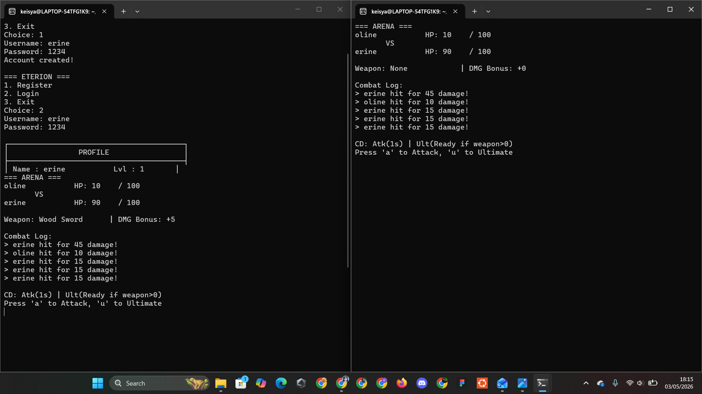

---
